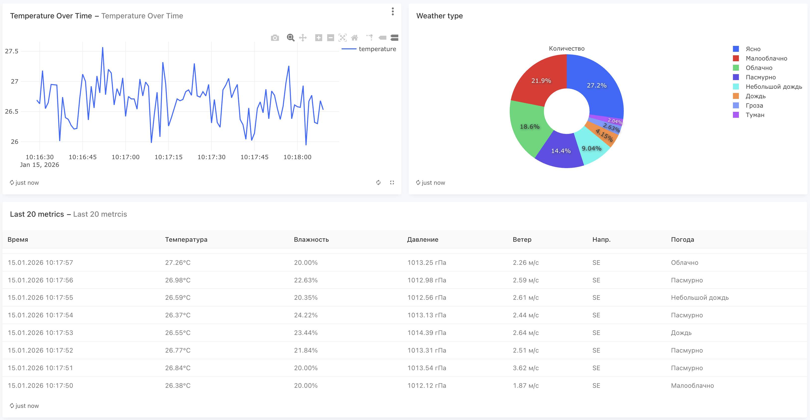
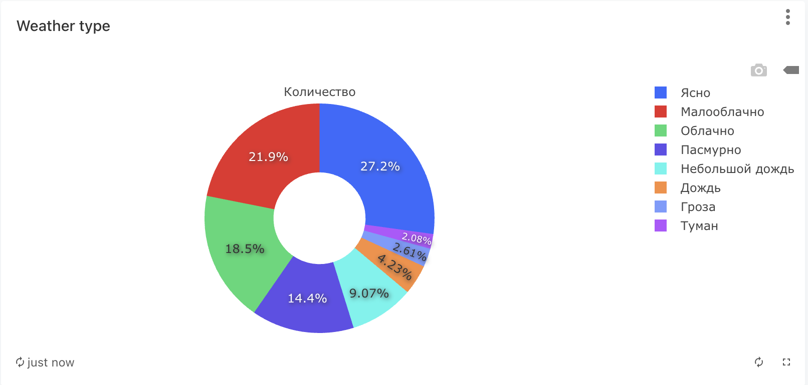
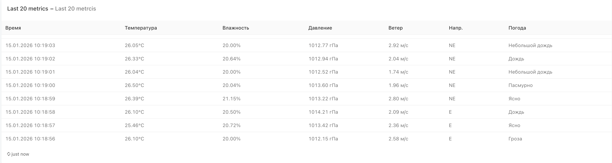

# 🌤️ Weather Station Analytics System

Мини-система сбора и анализа данных погодной станции.

## 📋 Описание проекта

Система состоит из следующих компонентов:

1. **Генератор данных** - Python-скрипт, который каждую секунду генерирует реалистичные показания погодной станции и записывает их в базу данных
2. **PostgreSQL** - база данных для хранения всех показаний
3. **Redash** - инструмент для создания дашбордов и визуализаций
4. **Jupyter Notebook** - для углублённого анализа данных

### Структура данных погодной станции

| Поле | Тип | Описание |
|------|-----|----------|
| `id` | SERIAL | Уникальный идентификатор записи |
| `timestamp` | TIMESTAMP | Время записи показаний |
| `temperature` | DECIMAL(5,2) | Температура воздуха (°C) |
| `humidity` | DECIMAL(5,2) | Относительная влажность (%) |
| `pressure` | DECIMAL(7,2) | Атмосферное давление (гПа) |
| `wind_speed` | DECIMAL(5,2) | Скорость ветра (м/с) |
| `wind_direction` | VARCHAR(10) | Направление ветра (N, NE, E, SE, S, SW, W, NW) |
| `weather_condition` | VARCHAR(50) | Состояние погоды |

## 🚀 Быстрый старт

### Требования

- Docker
- Docker Compose

### Запуск системы

```bash
# Клонировать репозиторий
git clone <URL_репозитория>
cd weather-station

# Запустить все сервисы
docker-compose up -d

# Посмотреть логи генератора данных
docker-compose logs -f data_generator
```

### Доступ к сервисам

| Сервис | URL | Описание |
|--------|-----|----------|
| **Redash** | http://localhost:5001 | Дашборды и визуализации |
| **Jupyter Notebook** | http://localhost:8888 | Анализ данных |
| **PostgreSQL** | localhost:5432 | База данных |

## 📊 Настройка Redash

### Первоначальная настройка

1. Создайте базу данных Redash:
```bash
docker-compose exec redash python /app/manage.py database create_tables
```

2. Откройте http://localhost:5001 и создайте аккаунт администратора

3. Добавьте источник данных:
   - Перейдите в **Settings** → **Data Sources** → **New Data Source**
   - Выберите **PostgreSQL**
   - Заполните параметры:
     - **Name**: Weather Station DB
     - **Host**: postgres
     - **Port**: 5432
     - **User**: weather_user
     - **Password**: weather_pass
     - **Database Name**: weather_db

### Примеры запросов для визуализаций

#### 1. Последние показания (таблица)
```sql
SELECT 
    timestamp,
    temperature || '°C' as "Температура",
    humidity || '%' as "Влажность",
    pressure || ' гПа' as "Давление",
    wind_speed || ' м/с' as "Скорость ветра",
    wind_direction as "Направление",
    weather_condition as "Погода"
FROM weather_data
ORDER BY timestamp DESC
LIMIT 20;
```

#### 2. График температуры за последний час
```sql
SELECT 
    date_trunc('minute', timestamp) as time,
    AVG(temperature) as avg_temperature,
    MIN(temperature) as min_temperature,
    MAX(temperature) as max_temperature
FROM weather_data
WHERE timestamp > NOW() - INTERVAL '1 hour'
GROUP BY date_trunc('minute', timestamp)
ORDER BY time;
```

#### 3. Распределение погодных условий (круговая диаграмма)
```sql
SELECT 
    weather_condition as "Погода",
    COUNT(*) as "Количество"
FROM weather_data
GROUP BY weather_condition
ORDER BY COUNT(*) DESC;
```

#### 4. Средние показатели по часам
```sql
SELECT 
    EXTRACT(HOUR FROM timestamp) as hour,
    ROUND(AVG(temperature)::numeric, 1) as avg_temp,
    ROUND(AVG(humidity)::numeric, 1) as avg_humidity,
    ROUND(AVG(pressure)::numeric, 1) as avg_pressure
FROM weather_data
GROUP BY EXTRACT(HOUR FROM timestamp)
ORDER BY hour;
```

#### 5. Роза ветров (направления ветра)
```sql
SELECT 
    wind_direction as "Направление",
    COUNT(*) as "Количество",
    ROUND(AVG(wind_speed)::numeric, 1) as "Средняя скорость"
FROM weather_data
GROUP BY wind_direction;
```

## 📓 Jupyter Notebook

Notebook с анализом данных находится в папке `notebooks/weather_analysis.ipynb`.

Для доступа:
1. Откройте http://localhost:8888
2. Перейдите в папку `work`
3. Откройте `weather_analysis.ipynb`

## 🛠️ Остановка системы

```bash
# Остановить все контейнеры
docker-compose down

# Остановить и удалить данные (volumes)
docker-compose down -v
```

## 📁 Структура проекта

```
weather-station/
├── docker-compose.yml      # Конфигурация Docker Compose
├── init.sql                # SQL-скрипт инициализации БД
├── README.md               # Документация проекта
├── generator/
│   ├── Dockerfile          # Dockerfile для генератора
│   ├── generator.py        # Скрипт генерации данных
│   └── requirements.txt    # Python-зависимости
└── notebooks/
    └── weather_analysis.ipynb  # Jupyter Notebook для анализа
```

## 📸 Скриншоты

### Redash Dashboard

Ниже — скриншоты с готового дашборда и визуализаций.







## 👤 Автор

Студент ДВФУ Головко Вадим Денисович
